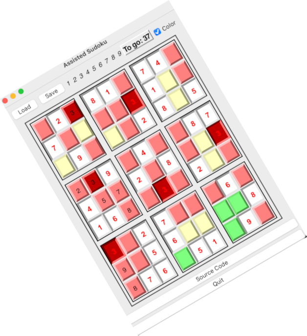

# Project Name



Implements the Sudoku game. The *soduko.py* module implements the basic function. *sudoku_tk* is a graphical user interface. 
*suduko_terminal* a command line interface. The tk version provides assistance by means of colors which will teach you to
become a better player. It's sort of educational cheating.

The GUI version allows you to play by moving the mouse to the desired field and clicking the (lef) button will bring
up a pop-up menu allow you to set the field to a specific value. Only legal moves are presented.

Right clicking you can freeze or unfreeze fields, allowing you to create new sudokus  and saving and possibly sharing them.

Sudokus can be read from and written to files. The files are in json format with one list of lists 
providing the currently set numbers and another list of list providing the frozen fields. Internally
the sudoku class works with numpy arrays for perfomance reasons.

With games2json you can convert traditional notations
into the json format. The subfolder games contains a set of 50 more or less difficult sudokus generated this way.

When you enter the game the previous state of the sudoku is quietly reloaded and saved when you exit the program. 
You have to explicitly select a new sudoku with load, to get a new one.

Frozen fields appear sunken, changeable fields raised.

The buttons are implemented as Tk Labels because buttons cannot be styled in Tk on the Mac on which I developed the game. 
This is necessary for providing color hints.

Colors indicate which fields may receive the number currently under the cursor in green, red otherwise.
Empty fields which have only one legal move left are indicated in yellow.

If you find my voice annoying when you won, just delete youwon.wav

## Table of Contents

- [Installation](#installation)
- [Usage](#usage)
- [Contributing](#contributing)
- [License](#license)

## Installation

Clone the directors install numpy, and playsound with pip or pipenv.


## Usage

run
```python sudoku_tk.py```

or

```python sudoku_tk.py```

## Contributing

[]: # (Inspired by [NeuralNine](https://www.youtube.com/watch?v=b_T-brYofN4) link.)
Really excellent young YouTuber on matters of python and data science. Fellow countryman
studiying at my Alma Mater. Thumbs up. I'm proud to have studied at the same university.

## License

No limitations on private or commercial re-use of the program in any way, no legal warranty provided.
